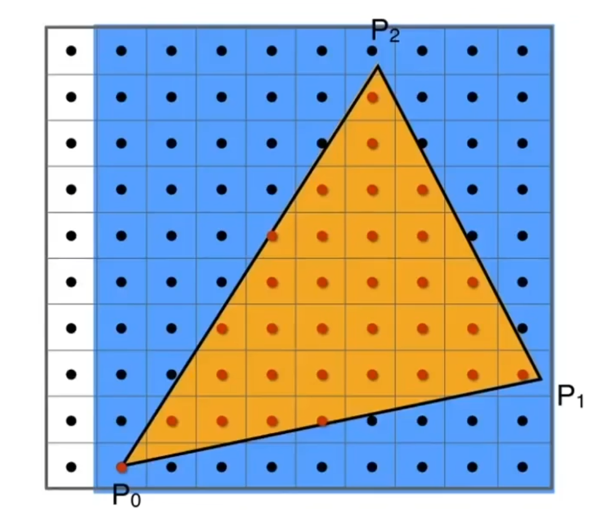

# Rasterization

* **What is a screen**

-An array of pixels

-Size of the array: resolution

-Atypical kind of raster display

* **Rasterize**

drawing onto the screen

* **Pixel**

A pixel is a little square with uniform color

Color is a mixtue of(red green blue)

Pixels indices are in the form of (x,y), where both x and y are integers

Pixels indices are from (0,0) to (width-1,height-1)

Pixels (x,y) is centered at (x+0.5,y+0.5)

The screen covers range (0,0) to (width,height)

## Canonical Cube to Screen

* Irrelevant to z
* Transform in xy plane:$[-1,1]^{2}$to [0,width]×[0,height]
* **Viewport transform matrix:**

$$
\left[
\begin{matrix}
\frac{width}{2}&0&0&\frac{width}{2}\\
0&\frac{height}{2}&0&\frac{height}{2}\\
0&0&1&0\\
0&0&0&1
\end{matrix}
\right]
$$

Trangles-Fundamental Shape Primitives

* Most basic polygon

* Break up other polygons

* Guaranteed to be planar

* Well-defined interior

* Well-defined method for interpolating values at vertices over triangle(bary centric interpolation)

  

**Jaggies**
