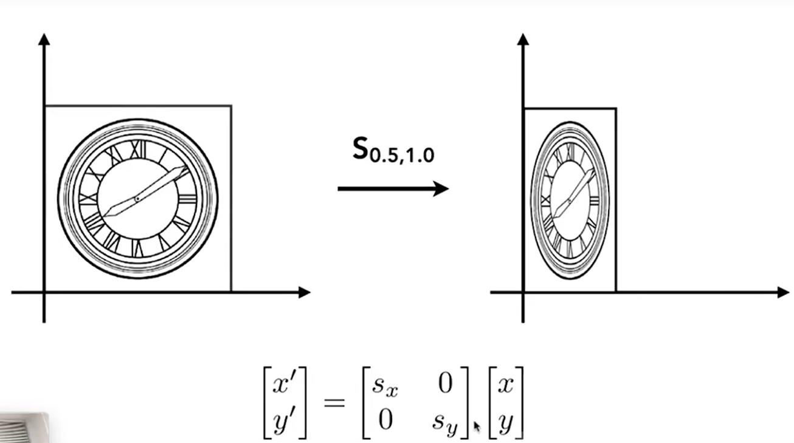
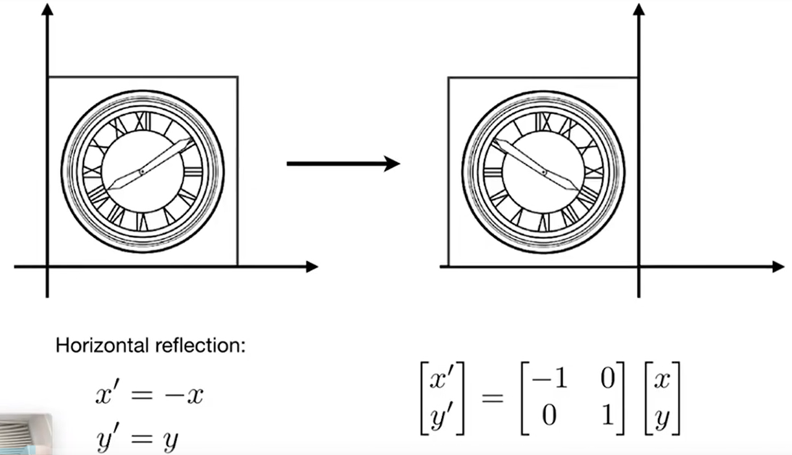
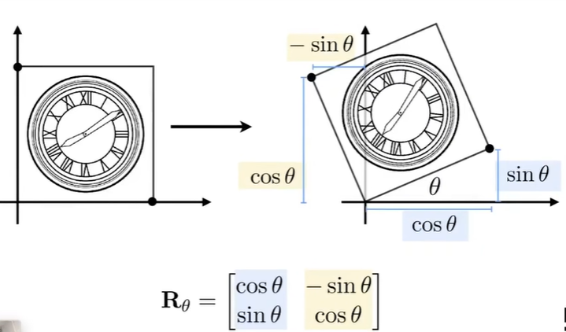

# Transformation

## Scale Matrix

## Refiection Matrix

## Shear Matrix

## Rotation Matrix

## 齐次坐标

上述**线性变换**均可用下式进行表示
$$
x^{\prime}=ax+by\\
y^{\prime}=cx+dy\\
$$

$$
\left[
\begin{matrix}
x^{\prime} \\
y^{\prime}
\end{matrix}
\right]=
\left[
\begin{matrix}
a&b \\
c&d
\end{matrix}
\right]
\left[
\begin{matrix}
x \\
y
\end{matrix}
\right]
$$

$$
\pmb{x^{\prime}}=\pmb{M}\pmb{x}
$$

但是**平移变换**并不能用上述形式表示:
$$
\left[
\begin{matrix}
x^{\prime} \\
y^{\prime}
\end{matrix}
\right]=
\left[
\begin{matrix}
a&b \\
c&d
\end{matrix}
\right]
\left[
\begin{matrix}
x \\
y
\end{matrix}
\right]+
\left[
\begin{matrix}
t_{x} \\
t_{y}
\end{matrix}
\right]
$$
通过引入**齐次坐标** ,可将平移变换变为矩阵与向量相乘**(先变换再平移)**的形式：
$$
\left[
\begin{matrix}
x^{\prime} \\
y^{\prime}\\
w^{\prime}
\end{matrix}
\right]=
\left[
\begin{matrix}
1&0&t_{x} \\
0&1&t_{y}\\
0&0&1
\end{matrix}
\right]
\left[
\begin{matrix}
x \\
y\\
1
\end{matrix}
\right]=
\left[
\begin{matrix}
x+t_{x} \\
y+t_{y}\\
1
\end{matrix}
\right]
$$

**仿射变换**为线性变化与平移变化之和：
$$
\left[
\begin{matrix}
x^{\prime} \\
y^{\prime}\\
1
\end{matrix}
\right]=
\left[
\begin{matrix}
a&b&t_{x} \\
c&d&t_{y}\\
0&0&1
\end{matrix}
\right]
\left[
\begin{matrix}
x \\
y\\
1
\end{matrix}
\right]
$$

## 3D Transformations

3D point $=(x,y,z,1)^{T}$

3D vector$=(x,y,z,0)^{T}$

$(x,y,z,w)$表示3D空间中的点$(x/w,y/w,z/w)$

