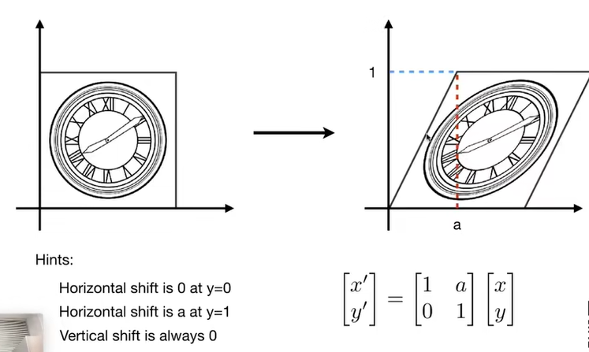
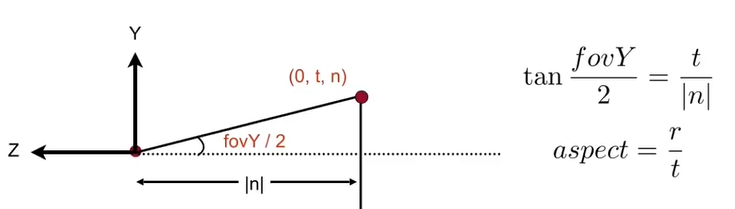

# Transformation

## Scale Matrix

## Refiection Matrix

## Shear Matrix

## Rotation Matrix

## 齐次坐标

上述**线性变换**均可用下式进行表示
$$
x^{\prime}=ax+by\\
y^{\prime}=cx+dy\\
$$

$$
\left[
\begin{matrix}
x^{\prime} \\
y^{\prime}
\end{matrix}
\right]=
\left[
\begin{matrix}
a&b \\
c&d
\end{matrix}
\right]
\left[
\begin{matrix}
x \\
y
\end{matrix}
\right]
$$

$$
\pmb{x^{\prime}}=\pmb{M}\pmb{x}
$$

但是**平移变换**并不能用上述形式表示:
$$
\left[
\begin{matrix}
x^{\prime} \\
y^{\prime}
\end{matrix}
\right]=
\left[
\begin{matrix}
a&b \\
c&d
\end{matrix}
\right]
\left[
\begin{matrix}
x \\
y
\end{matrix}
\right]+
\left[
\begin{matrix}
t_{x} \\
t_{y}
\end{matrix}
\right]
$$
通过引入**齐次坐标** ,可将平移变换变为矩阵与向量相乘**(先变换再平移)**的形式：
$$
\left[
\begin{matrix}
x^{\prime} \\
y^{\prime}\\
w^{\prime}
\end{matrix}
\right]=
\left[
\begin{matrix}
1&0&t_{x} \\
0&1&t_{y}\\
0&0&1
\end{matrix}
\right]
\left[
\begin{matrix}
x \\
y\\
1
\end{matrix}
\right]=
\left[
\begin{matrix}
x+t_{x} \\
y+t_{y}\\
1
\end{matrix}
\right]
$$

**仿射变换**为线性变化与平移变化之和：
$$
\left[
\begin{matrix}
x^{\prime} \\
y^{\prime}\\
1
\end{matrix}
\right]=
\left[
\begin{matrix}
a&b&t_{x} \\
c&d&t_{y}\\
0&0&1
\end{matrix}
\right]
\left[
\begin{matrix}
x \\
y\\
1
\end{matrix}
\right]
$$

## 3D Transformations

3D point $=(x,y,z,1)^{T}$

3D vector$=(x,y,z,0)^{T}$

$(x,y,z,w)$表示3D空间中的点$(x/w,y/w,z/w)$

$$
\left[
\begin{matrix}
x^{\prime} \\
y^{\prime}\\
z^{\prime}\\
1
\end{matrix}
\right]=
\left[
\begin{matrix}
a&b&c&t_{x} \\
c&d&f&t_{y}\\
g&h&i&t_{z}\\
0&0&0&1
\end{matrix}
\right]
\left[
\begin{matrix}
x \\
y\\
z\\
1
\end{matrix}
\right]
$$
**Rotation around x-,y-orz-axis**

**Compose any 3D rotation from $R_{x}$,$R_{y}$,$R_{z}$**
$$
R_{xyz}(\alpha,\beta,\gamma)=R_{x}(\alpha)R_{y}(\beta)R_{z}(\gamma)
$$
**旋转四元数**

一个旋转四元数可以表示为：
$$
q=w+xi+yi+zk=(w,v)=(w,x,y,z)
$$
其中：

* $w=cos(\theta/2)$是标量部分
* $v=(x,y,z)=usin(\theta/2)$是向量部分，$u$是旋转轴的单位向量，$\theta$是旋转角。

对应的旋转矩阵为：

# 3D图形渲染过程

## **一、Model Transformation**

将3D模型的坐标从模型空间转换到世界空间的过程

## 二、View/Camera Transformation

将世界空间中的坐标转换到相机空间

通过$M_{view}$矩阵转换相机
$$
M_{view}=R_{view}T_{view}
$$
**Translate e to origin**

**Rotate g to -Z,t to Y, (g×t) to X** 

Consider its inverse rotation；X to (g×t),Y to t,Z to -g

## 三、Projection Transformation

  

### Orthographic Projection

一般来说，我们希望将空间中的长方体映射为标准正方体。

1. 先将长方体中心平移到原点
2. 将长宽高压缩到[-1,1]

**投影矩阵**

### Perspective Projection

1. 近平面不变
2. 远平面z值不发生变化
3. 远平面中心点不发生变化

**根据相似三角形原理**

同样的，可知$x'=\frac{n}{z}x$,在齐次坐标中，
$$
\left[
\begin{matrix}
x \\
y\\
z\\
1
\end{matrix}
\right]=
\left[
\begin{matrix}
nx/z \\
ny/z\\
unknown\\
1
\end{matrix}
\right]
==
\left[
\begin{matrix}
nx \\
ny\\
still unknown\\
z
\end{matrix}
\right]
$$
则变换矩阵可写作;
$$
\left[
\begin{matrix}
n&0&0&0 \\
0&n&0&0\\
?&?&?&?\\
0&0&1&0
\end{matrix}
\right]
$$

解得
$$
A=n+f
$$

$$
B=-nf
$$

 **perspective matrix**
$$
P=\left[
\begin{matrix}
n&0&0&0 \\
0&n&0&0\\
0&0&n+f&-fn\\
0&0&1&0
\end{matrix}
\right]
$$
Concatenating **P** with **$M_{orth}$** results in the perspective projection matrix
$$
M_{per}=M_{orth}P
$$

**Field-of-View**

长宽比和垂直的可视角度
