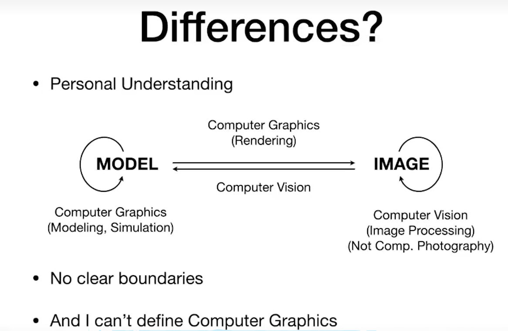

# 概论

## 主要研究问题

### 光栅化 Rasterization

将三维空间中的几何形体显示在屏幕上

计算机图形学中的实时：每秒至少可以生成30张画面

### 曲线和网格 Curves and Meshes

如何表示曲线和曲面

### 光线追踪 Ray Tracing

速度慢，但可以生成真实的画面，常用于游戏和动画中。

### 动画仿真 AnImation Simulation

## 计算机图形学与计算机视觉

涉及到理解，猜测，意义等方面即为计算机视觉

